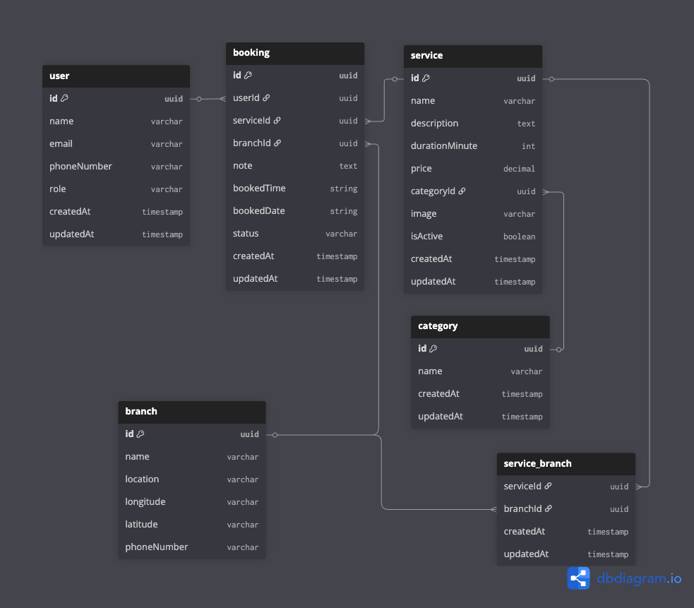

# IVY Backend - IVY Hair Studio Booking Management System

## Entity Relationship Diagram (ERD)

Below is the ERD for the IVY Hair Studio Booking Management System:



The ERD illustrates the relationships between users, bookings, services, categories, branches, and the service_branch junction table. Each booking is linked to a user, service, and branch. Services belong to categories and can be offered at multiple branches via the service_branch table.

A modern, scalable backend service for managing hair studio appointment bookings built with Go, following Clean Architecture principles and integrated with Clerk for authentication.

## Architecture Overview

This project implements **Clean Architecture** ensuring separation of concerns, testability, and maintainability. The architecture is designed to be independent of external frameworks, databases, and third-party services.

## Authentication with Clerk

This application uses **Clerk** as the authentication service, providing enterprise-grade authentication without the complexity of managing user credentials.

### Clerk Integration Features

- **Session Management**: JWT-based session tokens
- **Webhook Integration**: Real-time user sync between Clerk and your database
- **Multi-factor Authentication**: Built-in MFA support
- **Social Logins**: Google, Facebook
- **User Management**: Admin dashboard for user management

### Authentication Flow

1. **Frontend Authentication**: Users authenticate via Clerk's frontend SDKs
2. **JWT Verification**: Backend validates Clerk JWT tokens
3. **User Sync**: Clerk webhooks sync user data to local database
4. **Authorization**: Custom role-based access control

### Clerk Webhook Events

The system handles these Clerk webhook events:

- `user.created` - Creates new user record in local database
- `user.updated` - Updates existing user information
- `user.deleted` - Soft deletes user from local database

## API Endpoints

### User Management

- `GET /api/v1/user` - List all users (Admin only)
- `GET /api/v1/user/me` - Get current user profile (Authenticated)
- `GET /api/v1/user/:id` - Get user by ID (Authenticated)
- `PUT /api/v1/user/:id` - Update user profile (Owner/Admin)
- `POST /api/v1/user/clerk-user-webhook` - Clerk webhook endpoint (Public)

### Branch Management

- `GET /api/v1/branch` - List all branches (Public)
- `GET /api/v1/branch/:id` - Get branch details (Public)
- `POST /api/v1/branch` - Create branch (Admin only)
- `PUT /api/v1/branch/:id` - Update branch (Admin only)
- `DELETE /api/v1/branch/:id` - Delete branch (Admin only)

### Category Management

- `GET /api/v1/category` - List all categories (Public)
- `GET /api/v1/category/:id` - Get category details (Public)
- `POST /api/v1/category` - Create category (Admin only)
- `PUT /api/v1/category/:id` - Update category (Admin only)
- `DELETE /api/v1/category/:id` - Delete category (Admin only)

### Service Management

- `GET /api/v1/service` - List all services with filters (Public)
- `GET /api/v1/service/:id` - Get service details (Public)
- `POST /api/v1/service` - Create service (Admin only)
- `PUT /api/v1/service/:id` - Update service (Admin only)
- `DELETE /api/v1/service/:id` - Delete service (Admin only)

### Booking Management

- `GET /api/v1/booking` - List all bookings with filters (Admin/Staff)
- `GET /api/v1/booking/me` - Get user's bookings (Authenticated)
- `GET /api/v1/booking/slots` - Get available time slots (Authenticated)
- `GET /api/v1/booking/:id` - Get booking details (Owner/Admin)
- `POST /api/v1/booking` - Create new booking (Authenticated)
- `PUT /api/v1/booking/:id` - Update booking (Owner/Admin)
- `DELETE /api/v1/booking/:id` - Cancel booking (Owner/Admin)

### Authentication Middleware

Routes are protected based on user roles:

- **Public**: No authentication required
- **Authenticated**: Valid Clerk JWT token required
- **Admin**: Admin role required
- **Owner**: Resource owner or admin access required

## Technology Stack

### Backend Framework

- **Go 1.24+**: Modern, performant language
- **Echo v4**: High-performance HTTP framework
- **GORM**: Feature-rich ORM for Go

### Database & Caching

- **PostgreSQL**: Primary database with ACID compliance

### Authentication & Security

- **Clerk**: Enterprise authentication service
- **JWT**: Stateless authentication tokens
- **CORS**: Cross-origin resource sharing
- **Rate Limiting**: API protection

### Development & Deployment

- **Docker**: Containerization
- **Docker Compose**: Multi-service orchestration
- **Air**: Live reloading for development
- **Makefile**: Build automation

## Getting Started

### Prerequisites

- Go 1.24 or higher
- Docker & Docker Compose
- PostgreSQL 13+ (if running locally)
- Clerk account and API keys

### Installation

1. **Install prerequisites**

   - **Make**

     - macOS: `brew install make`
     - Ubuntu/Debian: `sudo apt-get install make`
     - Windows: [Install via Chocolatey or download from GNU](https://www.gnu.org/software/make/)

   - **Docker & Docker Compose**
     - [Download Docker Desktop](https://www.docker.com/products/docker-desktop/)
     - Or install via package manager for your OS

2. **Clone the repository**

   ```bash
   git clone <repository-url>
   cd ivy-backend
   ```

3. **Environment Setup**

   ```bash
   cp .env.local .env
   # Edit .env with your configuration
   ```

4. **Start local development server**

   ```bash
   make air-dev
   ```

## Query & Filtering

The API supports advanced filtering and pagination:

### Booking Filters

- `user_id`: Filter by user
- `branch_id`: Filter by branch
- `service_id`: Filter by service
- `status`: Filter by status (comma-separated)
- `booked_date`: Filter by date
- `sort_by`: Sort field
- `sort_order`: asc/desc
- `limit`/`offset`: Pagination

### Example Request

```bash
GET /api/v1/booking?status=PENDING,CONFIRMED&branch_id=123&limit=10&offset=0&sort_by=created_at&sort_order=desc
```

## Security Features

### Authentication Security

- **JWT Validation**: Clerk-issued JWT tokens
- **Token Expiration**: Automatic token refresh
- **Role-based Access**: User and Admin roles
- **API Rate Limiting**: Prevent abuse

### Data Security

- **SQL Injection Prevention**: Parameterized queries
- **Input Validation**: Comprehensive request validation
- **Error Handling**: Secure error responses
- **HTTPS Enforcement**: TLS encryption

## Performance Optimizations

### Database Optimizations

- **Connection Pooling**: Efficient database connections
- **Query Optimization**: Indexed fields and efficient queries
- **Pagination**: Memory-efficient data loading
- **Preloading**: Eager loading of related entities

## Deployment

### Docker Deployment

```bash
# Build and start all services
docker-compose up --build -d

# View logs
docker-compose logs -f api
```

### Production Environment

```bash
# Build optimized binary
make build-prod

# Run with production settings
ENVIRONMENT=production ./main
```

### Environment Variables

```env
# Application
ENVIRONMENT=production
PORT=8080
API_VERSION=v1

# Database
DB_HOST=your-db-host
DB_PORT=5432
DB_USER=your-db-user
DB_PASSWORD=your-db-password
DB_NAME=ivy_production

# Clerk
CLERK_SECRET_KEY=your-production-secret
CLERK_PUBLISHABLE_KEY=your-production-key
CLERK_WEBHOOK_SECRET=your-webhook-secret
```

---

**Built with Go, Clean Architecture, and Clerk Authentication**
